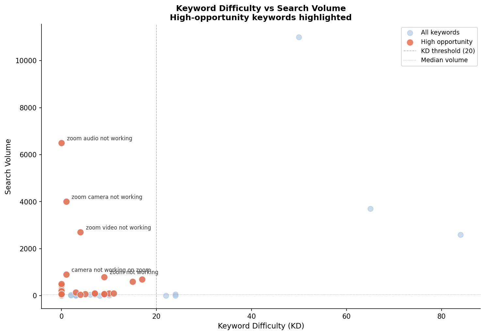
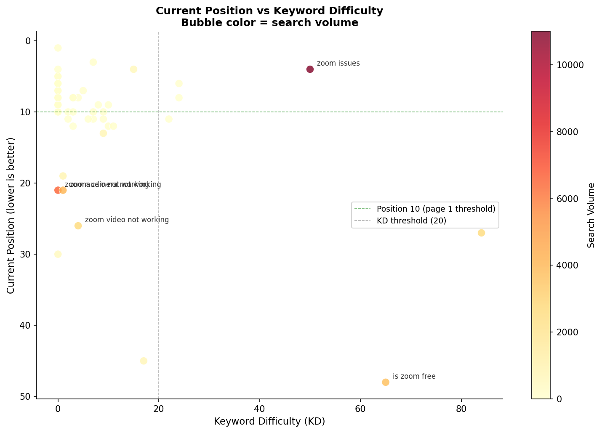
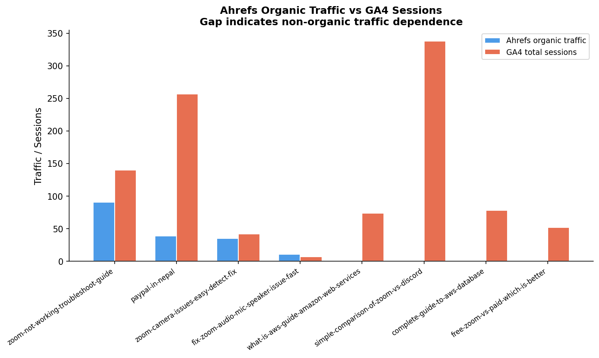
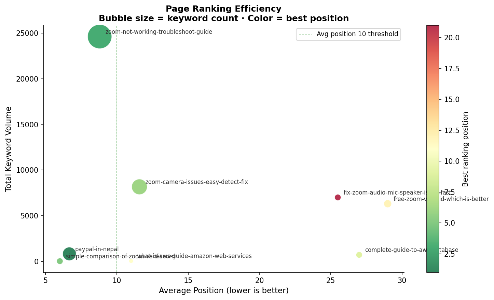
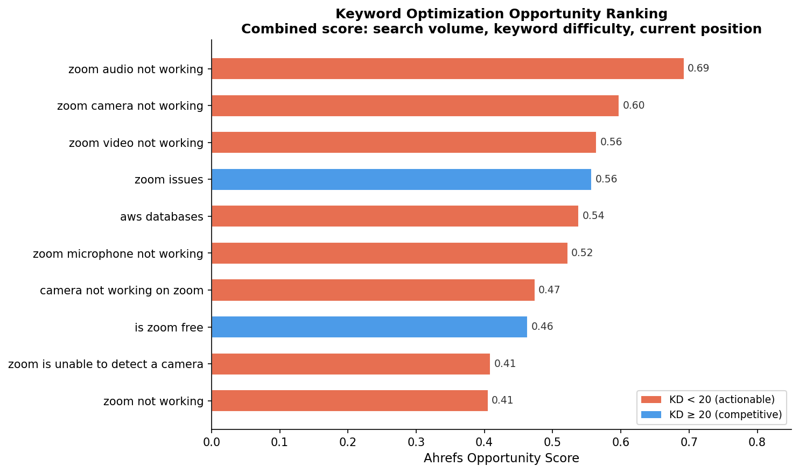

# Ahrefs SEO Analysis

Keyword difficulty, competitive positioning, and page-level ranking analysis using Ahrefs organic data for a Nepal-based IT and cloud consulting firm.

> Data files are excluded from this repository. See `data/README.md` for schema and export instructions.

---

## Overview

This milestone expands the Google analysis by introducing external competitive data from Ahrefs. Where the Google analysis measured what users did after arriving, this Ahrefs analysis measures the competitive landscape that determines whether they arrive at all.

The three-layer analytical framework:

```
Keywords → what opportunities exist
     ↓
Positions → how well are we capturing them
     ↓
Pages → what is the overall page-level result
```

**Datasets:** Organic keywords · Organic positions · Top pages
**Total keywords analyzed:** 57 keywords · 60 position records · 8 pages

---

## Data sources

| File | Description |
|------|-------------|
| `ahrefs_organic_keywords.csv` | Keyword-level data including volume, KD, CPC, intent flags, current position, and current URL |
| `ahrefs_organic_positions.csv` | Position-level data linking keywords to URLs with ranking details |
| `ahrefs_top_pages.csv` | Page-level summary including URL Rating, traffic, referring domains, and top keyword |

---

## Key findings

### 1. Keyword difficulty landscape

The site's tracked keyword portfolio is dominated by low-competition terms:

- Mean KD: 7.5
- Median KD: 2.0
- 75% of keywords have KD ≤ 8

This represents a significant opportunity: most keywords the site ranks for face minimal competition, yet several high-volume terms are being captured inefficiently.

### 2. High-opportunity keywords

24 keywords meet the high-opportunity threshold (volume above median, KD below 20). The top three by opportunity score:

| Keyword | Volume | KD | Current position |
|---------|--------|----|-----------------|
| zoom audio not working | 6,500 | 0 | 21 |
| zoom camera not working | 4,000 | 1 | 21 |
| zoom video not working | 2,700 | 4 | 26 |

All three are near-zero competition keywords with significant search volume, currently ranking on page 2-3. These represent the highest-leverage optimization targets in the dataset.



### 3. Position vs keyword difficulty

Most keywords rank within page 1 (median position: 9), but the highest-volume low-KD keywords are significantly underranking:

- zoom audio not working: 6,500 volume, KD 0, position 21
- zoom camera not working: 4,000 volume, KD 1, position 21
- zoom video not working: 2,700 volume, KD 4, position 26

These are all served by the same page (`/blogs/fix-zoom-audio-mic-speaker-issue-fast/`), suggesting the page needs structural and content improvements to capture the traffic it should organically own.



### 4. Intent classification comparison

Ahrefs classifies all 57 tracked keywords as Informational, with only 1 Commercial and 0 Transactional. The set rule-based classifier from the Google analysis findings produced a more granular split across Troubleshooting, Commercial, Local, and Informational categories.

This discrepancy is expected as Ahrefs uses broader intent buckets while our classifier was tuned to the specific query patterns in this dataset. The future coherence analysis will examine this disagreement in detail.

### 5. Ahrefs organic traffic vs GA4 sessions

Joining Ahrefs page traffic with GA4 sessions reveals significant gaps for several pages:

| Page | Ahrefs traffic | GA4 sessions | Gap |
|------|---------------|--------------|-----|
| zoom-vs-discord | 1 | 338 | 337× |
| complete-guide-to-aws-database | 0 | 78 | — |
| free-zoom-vs-paid | 0 | 52 | — |
| paypal-in-nepal | 39 | 257 | 6× |

Pages with large gaps are heavily dependent on non-organic traffic sources. The zoom-vs-discord page in particular receives almost no organic search traffic despite 338 GA4 sessions, suggesting social or referral traffic is driving its numbers.



### 6. Page ranking efficiency

The zoom-not-working troubleshoot guide is the strongest page in the Ahrefs dataset:

- 29 ranked keywords
- Average position 8.8
- Best position 3
- Total keyword volume 24,620

The audio/mic speaker page is the most underperforming relative to its potential — 7,000 total keyword volume but average position 25.5 across only 2 keywords.



### 7. Keyword opportunity ranking

Combined opportunity score weighting volume (40%), KD gap (35%), and position gap (25%):



---

## Project structure

```text
ahrefs-analysis/
│
├── notebook-ahrefs/
│   └── ahrefs-seo-analysis.ipynb
│
└── output-ahrefs/
    └── chart/
        ├── kd_vs_volume.png
        ├── position_vs_kd.png
        ├── keyword_opportunity.png
        ├── ahrefs_vs_ga4.png
        └── page_ranking_efficiency.png
└── README.md
```

---

## Tech stack

| Tool | Purpose |
|------|---------|
| Python | Data processing |
| Pandas | Cleaning, merging, feature engineering |
| Matplotlib | Visualization |
| Jupyter Notebook | Analysis workflow |
| Git & GitHub | Version control |

---
**Author**

Sonam Lama
