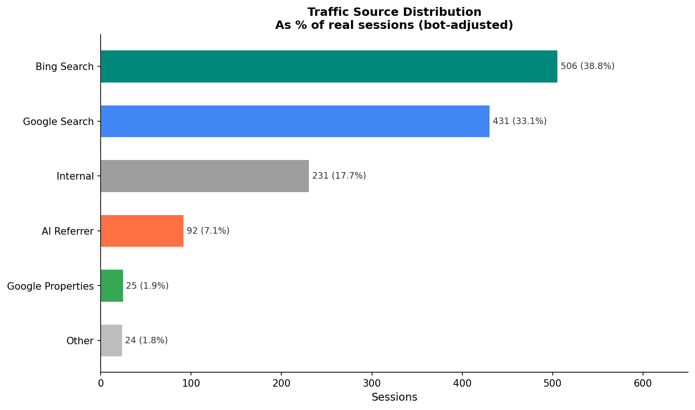
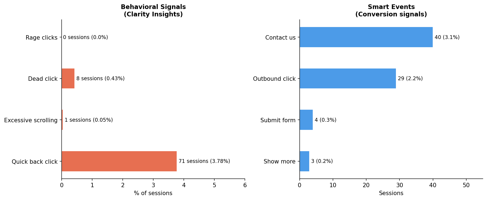
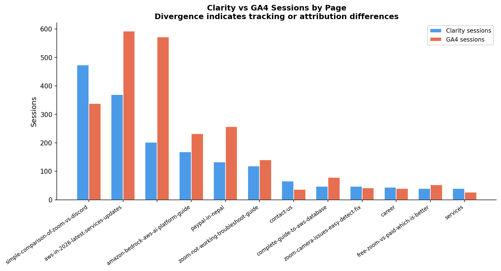
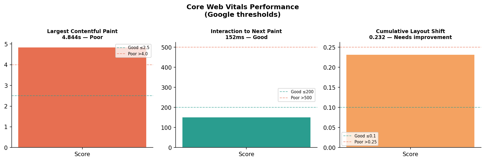
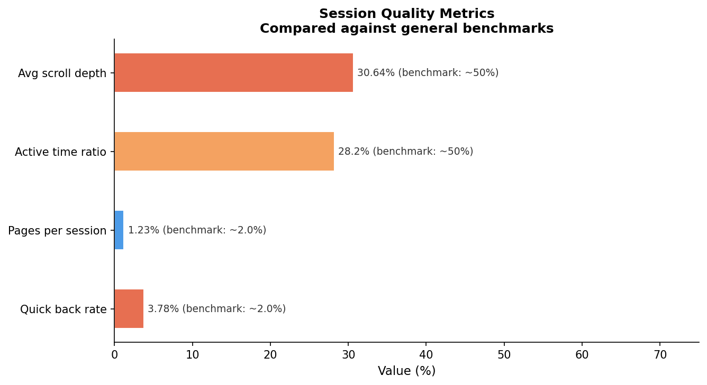

# Microsoft Clarity Analysis

User behavior and session quality analysis using Microsoft Clarity data for a Nepal-based IT and cloud consulting firm.

> Data files are excluded from this repository. See `data/README.md` for schema and export instructions.

---

## Overview

Where the analysis for Google measured search visibility and engagement metrics, and the Ahrefs analysis measured competitive keyword positioning, the analysis for Clarity introduces behavioral data: how users actually interact with pages after arriving. 

Microsoft Clarity provides session-level behavioral signals, including scroll depth, click patterns, traffic sources, smart events, and Core Web Vitals performance scores.

**Dataset:** Single multi-section Clarity CSV export  
**Total sessions:** 1,876 reported · 1,304 real (bot-adjusted)  
**Analysis period:** Matching the first two phases.

---

## Data structure

Unlike conventional flat CSVs, the Clarity export embeds multiple report sections inside a single file, each preceded by a `Metric` header row. A programmatic section detection pipeline was built to parse and extract each block into its own structured dataframe.

Sections extracted:

| Section | Content |
|---------|---------|
| Sessions | Total and bot session counts |
| Bot traffic | Bot session breakdown by type |
| Pages per session | Average pages viewed per visit |
| Scroll depth | Average scroll percentage |
| Active time spent | Active vs total time ratio |
| Users overview | Unique, new, and returning users |
| Insights | Rage clicks, dead clicks, quick back clicks |
| Browsers | Session distribution by browser |
| Top pages | Page-level session counts |
| Smart events | Conversion signal tracking |
| Referrer | Traffic source breakdown |
| JavaScript errors | Frontend error tracking |
| Performance overview | Core Web Vitals scores |

---

## Bot session adjustment

Clarity reported 572 deduplicated bot sessions out of 1,876 total — 30.5% of all sessions. Bot categories included web scrapers, suspicious devices, suspicious networks, and suspicious interactions. All percentage-based metrics use **1,304 real sessions** as the baseline to ensure findings reflect genuine human behavior.

---

## Key findings

### 1. Traffic source distribution

Bing Search (38.8%) outperforms Google Search (33.1%) as the top organic traffic source. This is an unusual finding that suggests strong Bing SEO performance or a user demographic skewing toward Edge/Bing users.

AI referrers account for 7.1% of real sessions (92 sessions) across Gemini, ChatGPT, Perplexity, and Copilot combined, which is a meaningful and growing traffic channel worth monitoring as AI-generated search responses increasingly link to external sources.



### 2. Behavioral signals

Quick back clicks at 3.78% (71 sessions) are the dominant negative behavioral signal, which is users landing and immediately returning to the previous page. 

This directly supports the intent mismatch finding from the Google analysis, where high-impression pages showed weak engagement efficiency. The 4.844s LCP (see Web Vitals) likely contributes to this figure as users are clicking back before the page finishes loading.

Zero rage clicks indicate the UI itself is not causing frustration. The issue is content and performance, not interface design.



### 3. Conversion signals

Contact us triggered in 3.1% of real sessions (40 sessions), making it the strongest conversion signal in the dataset. Outbound clicks (2.2%, 29 sessions) suggest users are following external links, which are likely to Zoom or AWS partner pages. Form submissions at 0.3% (4 sessions) indicate very low bottom-of-funnel conversion.

### 4. Clarity vs GA4 session comparison

Joining Clarity and GA4 session counts per page reveals systematic divergences:

| Page | Clarity | GA4 | Interpretation |
|------|---------|-----|----------------|
| zoom-vs-discord | 473 | 338 | GA4 likely missing sessions blocked by ad blockers |
| aws-in-2026 | 370 | 592 | GA4 counting non-human traffic Clarity filters |
| Homepage | 202 | 572 | Large bot/automated traffic inflating GA4 |
| zoom-not-working | 119 | 140 | Closest agreement — most organically driven page |

Pages with closest Clarity/GA4 agreement tend to be the most organically driven. Large gaps indicate either bot inflation in GA4 or ad-blocker-driven undercounting in either tool.



### 5. Core Web Vitals

| Metric | Score | Status |
|--------|-------|--------|
| LCP (Largest Contentful Paint) | 4.844s | Poor (threshold: ≤2.5s) |
| INP (Interaction to Next Paint) | 152ms | Good (threshold: ≤200ms) |
| CLS (Cumulative Layout Shift) | 0.232 | Needs improvement (threshold: ≤0.1) |

LCP at 4.844s is the most critical technical issue. This is nearly double the threshold. Slow initial load directly contributes to quick back clicks and low scroll depth. CLS at 0.232 indicates layout instability during page load, degrading user experience. INP is the only passing metric, meaning the site responds well to interactions once loaded.



### 6. Session quality

| Metric | Value | Reference point |
|--------|-------|----------------|
| Avg scroll depth | 30.64% | ~50% for content sites |
| Active time ratio | 28.2% | ~50% |
| Pages per session | 1.23 | ~2.0 |
| Quick back rate | 3.78% | ~2.0% |

All four metrics underperform general reference points. The pattern is consistent: slow load times drive quick exits, low scroll depth suggests users aren't reaching the main content, and minimal pages per session indicate little site exploration beyond the landing page.



---

## Project structure

```text
clarity-analysis/
│
├── notebook-clarity/
│   └── clarity-seo-analysis.ipynb
│
└── output-clarity/
    └── chart/
        ├── traffic_sources.png
        ├── behavioral_signals.png
        ├── clarity_vs_ga4.png
        ├── core_web_vitals.png
        └── session_quality.png
```

---

## Tech stack

| Tool | Purpose |
|------|---------|
| Python | Data processing |
| Pandas | Section parsing, cleaning, merging |
| Matplotlib | Visualization |
| Jupyter Notebook | Analysis workflow |
| Git & GitHub | Version control |

---

## Next milestone

**Cross-tool Coherence Analysis** will synthesize findings across all three milestones (GSC, GA4, Ahrefs, and Clarity) to test whether the tools tell a consistent story about content performance, or where they meaningfully disagree.

---
