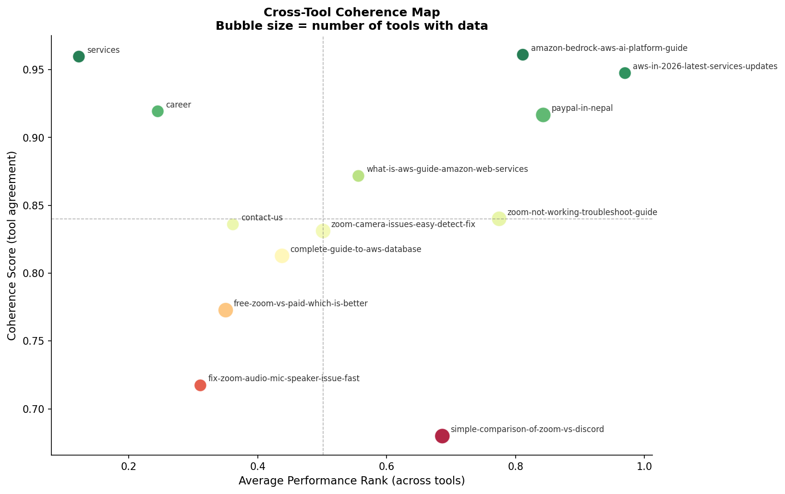
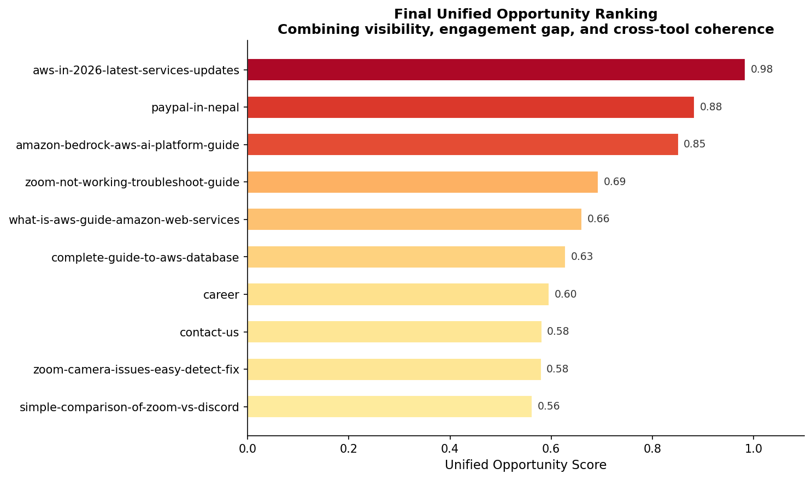

# Cross-Tool Coherence Analysis

Unified SEO intelligence synthesizing Google Search Console, Google Analytics 4, Ahrefs, and Microsoft Clarity into a single opportunity ranking for a Nepal-based IT and cloud consulting firm.

> Data files are excluded from this repository. See `data/README.md` for schema and export instructions.

---

## Overview

This is the capstone milestone of the project. Milestones 1–3 analyzed search visibility, behavioral engagement, competitive positioning, and user behavior independently. This milestone tests whether those four tools tell a **consistent** story about content performance — and builds a single unified score where they agree.

**Core question:** Do GSC, GA4, Ahrefs, and Clarity agree on which pages perform well — and where they disagree, what does that disagreement reveal?

**Pages analyzed:** 13 pages with data from 2 or more tools

---

## Methodology

### 1. Unified dataset construction
Page-level metrics from all three milestones were merged on a normalized `Page` key using an outer join, then filtered to pages with coverage from at least 2 of the 3 external tools (GSC/GA4 counted as one source, Ahrefs as a second, Clarity as a third).

### 2. Coherence scoring
For each page, performance was percentile-ranked independently within each tool's own metric (GSC impressions, GA4 sessions, Ahrefs traffic, Clarity sessions). The standard deviation across these ranks was computed per page — low spread means the tools agree on relative performance; high spread means they disagree.

```
coherence_score = 1 - std(percentile_ranks across tools)
```

### 3. Unified opportunity score
The final score combines three normalized components:

| Component | Weight | Rationale |
|-----------|--------|-----------|
| Visibility (GSC impressions) | 35% | Existing reach and optimization leverage |
| Engagement gap (GA4) | 35% | How far a page is from satisfying users |
| Coherence score | 30% | Confidence that the finding is real, not a measurement artifact |

---

## Key findings

### 1. High-coherence, high-traffic pages

Three pages show both high traffic rank and high cross-tool agreement:

| Page | Avg rank | Coherence score |
|------|----------|----------------|
| aws-in-2026-latest-services-updates | 0.97 | 0.95 |
| amazon-bedrock-aws-ai-platform-guide | 0.81 | 0.96 |
| paypal-in-nepal | 0.84 | 0.92 |

Every tool independently confirms these are the highest-traffic pages on the site. This is the highest-confidence segment of the analysis — no measurement artifact explains their prominence.

### 2. The most contested page

`/blogs/simple-comparison-of-zoom-vs-discord` has the lowest coherence score (0.68) in the dataset. Tool-reported traffic for this single page:

| Tool | Value |
|------|-------|
| Clarity sessions | 473 |
| GA4 sessions | 338 |
| Ahrefs organic traffic | 1 |

A 473× spread between Ahrefs and Clarity on the same page. This page receives almost no organic search traffic (confirmed independently in Milestone 2) yet shows strong session volume in GA4 and Clarity — strongly suggesting social, referral, or direct traffic dominates this page's audience, not search.

### 3. Confirmed underperformer across every signal

`/blogs/fix-zoom-audio-mic-speaker-issue-fast` scores low on both rank (0.31) and coherence (0.72) — meaning it's confirmed low-traffic by multiple tools, but the tools also disagree about exactly how low. Combined with the Milestone 2 finding that this page sits on three near-zero-competition keywords worth 6,500+ combined search volume, this page represents a confirmed, multi-signal optimization target.



### 4. Final unified opportunity ranking

Combining visibility, engagement gap, and coherence into one score produces a clear priority order. The AWS content cluster — aws-in-2026, paypal-in-nepal, and amazon-bedrock — occupies the top 3 positions, independently confirming the Milestone 1 finding that this cluster is the single largest optimization opportunity on the site.

| Rank | Page | Unified opportunity score |
|------|------|--------------------------|
| 1 | aws-in-2026-latest-services-updates | 0.98 |
| 2 | paypal-in-nepal | 0.88 |
| 3 | amazon-bedrock-aws-ai-platform-guide | 0.85 |
| 4 | zoom-not-working-troubleshoot-guide | 0.69 |
| 5 | what-is-aws-guide-amazon-web-services | 0.66 |



---

## Synthesis across all four milestones

| Milestone | Contribution to final finding |
|-----------|-------------------------------|
| 1 — GSC × GA4 | Identified the AWS cluster's visibility-engagement gap |
| 2 — Ahrefs | Identified specific underranking keywords and confirmed non-organic traffic on contested pages |
| 3 — Clarity | Identified the technical (LCP) and behavioral (quick back clicks) causes behind the engagement gap |
| 4 — Coherence | Confirmed the AWS cluster finding independently across all tools, and surfaced which pages have unreliable, tool-dependent metrics |

The convergence of four independent analytical approaches on the same conclusion — that the AWS content cluster is the primary optimization priority — is the strongest possible evidence for that recommendation.

---

## Project structure

```text
coherence-analysis/
│
├── notebook-coherence/
│   └── coherence-analysis.ipynb
│
└── output-coherence/
    └── chart/
        ├── coherence_map.png
        └── unified_opportunity.png
```

---

## Tech stack

| Tool | Purpose |
|------|---------|
| Python | Data processing |
| Pandas | Merging, ranking, scoring |
| NumPy | Statistical calculations |
| Matplotlib | Visualization |
| Jupyter Notebook | Analysis workflow |
| Git & GitHub | Version control |

---

**Author**  
Sonam Lama