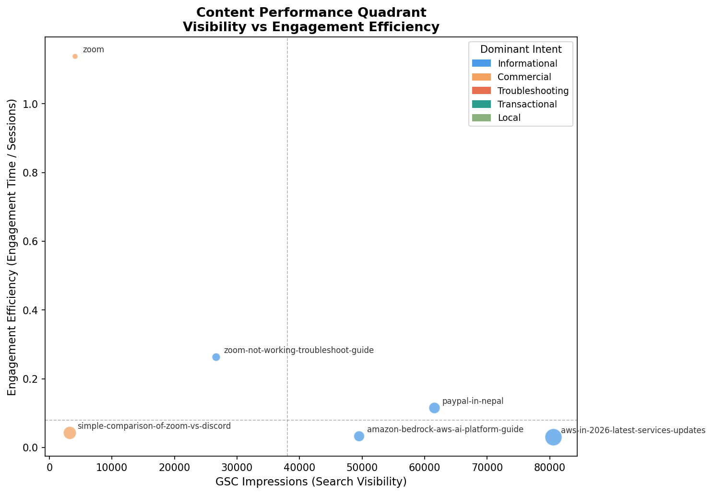
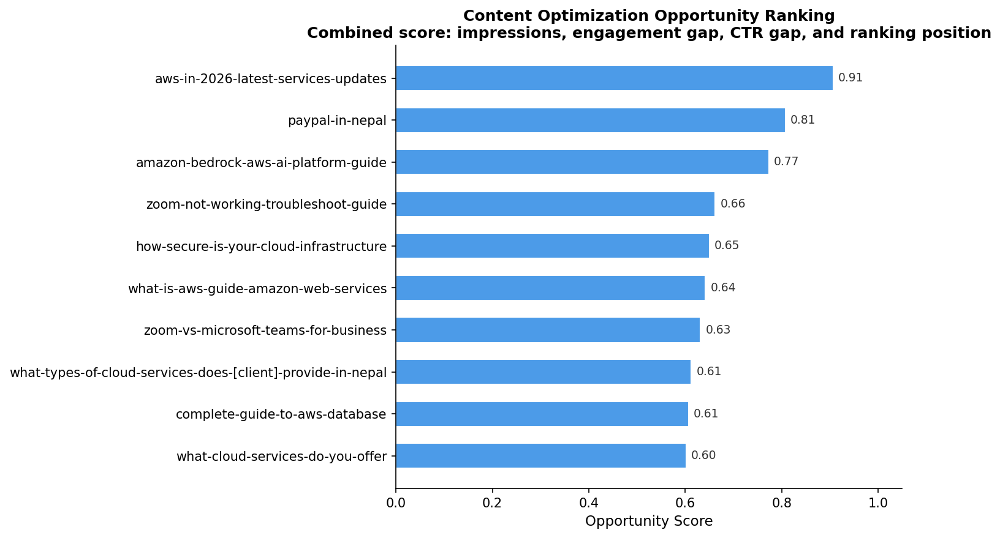

# Google Search Analytics Intelligence System

Cross-platform SEO and engagement analysis integrating Google Search Console and Google Analytics 4 to evaluate content performance across visibility, traffic, engagement quality, and optimization opportunities for a Nepal-based IT and cloud consulting firm.

> Data files are excluded from this repository. See `data/README.md` for schema and export instructions.

---

## Overview

This milestone builds a page-level SEO analytics pipeline that merges two datasets most teams analyze in isolation: search visibility data from Google Search Console and behavioral engagement data from Google Analytics 4.

The core question driving the analysis:

> Does a page that ranks well actually satisfy the users who find it?

**Pages analyzed:** 74 matched pages (GSC × GA4 inner join)
**Analysis period:** January – May 2026

---

## Data sources and integration

| Platform | Metrics |
|----------|---------|
| Google Search Console | Clicks · Impressions · CTR · Average position |
| Google Analytics 4 | Sessions · Active users · New users · Engagement time · Conversion signals |

GSC exports full URLs while GA4 exports relative paths. A normalization pipeline strips domains, lowercases paths, and removes trailing slashes before merging on the `Page` key.

---

## Engineered metrics

| Metric | Formula | Purpose |
|--------|---------|---------|
| `visibility_score` | `impressions × CTR` | Effective visibility weighted by click likelihood |
| `click_to_session_ratio` | `ga_sessions / gsc_clicks` | Detects external or non-organic traffic dependence |
| `engagement_efficiency` | `engagement_time / sessions` | Measures content quality efficiency |
| `engagement_per_session` | engagement time per page | Absolute engagement depth |

---

## Page classification

| Category | Logic | Interpretation |
|----------|-------|-----------------|
| High visibility / low engagement | impressions > 20,000 AND sessions < 100 | Strong rankings but weak satisfaction |
| High quality content | engagement time > 30s | Users invest meaningful time |
| High traffic driver | GSC clicks > 100 | Proven organic demand |
| Normal | Remaining pages | Baseline performers |

---

## Key findings

### 1. The visibility–engagement gap

The highest-impression page, `/blogs/aws-in-2026-latest-services-updates`, generated 80,547 impressions but only 17.7s average engagement time and an engagement_efficiency of 0.03. Meanwhile `/zoom`, with 95% fewer impressions (4,076), generated 74s of engagement and an efficiency score of 1.14.

This pattern repeats across the dataset: high visibility does not necessarily indicate strong content satisfaction.

### 2. AWS content cluster: visibility without engagement

`/blogs/aws-in-2026-latest-services-updates`:
- 80,547 impressions · 29 GSC clicks · 592 GA4 sessions
- 17.7s average engagement · CTR 0.04%
- `click_to_session_ratio` of 20× — most session volume is non-organic

The combination of strong rankings, extremely low CTR, and weak engagement suggests a search-intent mismatch despite high visibility.

### 3. Zoom content cluster: quality over volume

`/zoom`: 74s average engagement · 107 clicks · 4,076 impressions · efficiency 1.14
`/blogs/zoom-not-working-troubleshoot-guide`: 36.8s average engagement · 140 sessions

Both pages substantially outperform AWS informational content on engagement, indicating stronger intent alignment.

### 4. PayPal in Nepal: high-demand niche query

`/blogs/paypal-in-nepal`: 349 GSC clicks · average position 4.46 · 257 sessions · 215 new users · 29.6s engagement

Strong informational and local search demand, with high acquisition capability. The moderate engagement time reflects users finding answers quickly rather than shallow engagement.

---

## Query intent analysis

2,611 queries across 6 major pages were classified into five intent categories using a rule-based keyword classifier.

| Intent type | Description |
|-------------|--------------|
| Informational | Learning or explanation-driven searches |
| Commercial | Comparison, pricing, or evaluation intent |
| Troubleshooting | Error resolution or issue-fixing intent |
| Transactional | Action-oriented conversion intent |
| Local | Geographic or regional intent |

### Dominant intent by page

| Page | Dominant intent | Engagement efficiency |
|------|-----------------|----------------------|
| /zoom | Commercial | 1.14 |
| /blogs/zoom-not-working-troubleshoot-guide | Troubleshooting | 0.26 |
| /blogs/paypal-in-nepal | Informational + Local | 0.12 |
| /blogs/simple-comparison-of-zoom-vs-discord | Commercial | 0.04 |
| /blogs/aws-in-2026-latest-services-updates | Informational | 0.03 |
| /blogs/amazon-bedrock-aws-ai-platform-guide | Informational | 0.03 |

### Key insight: same intent, different outcomes

Both `/zoom` and `/blogs/simple-comparison-of-zoom-vs-discord` are dominated by commercial-intent queries, yet engagement efficiency differs by nearly 27×. Intent classification alone does not determine success — content specificity and execution quality matter substantially more.

### Local intent signal

143 of 510 PayPal queries contain geographic qualifiers ("in nepal", "available in nepal", "legal in nepal"). This explains the page's strong click performance and high new-user acquisition despite moderate engagement depth.

### Content performance quadrant

Plotting search visibility (impressions) against engagement efficiency, with bubble size representing session volume and color representing dominant query intent, reveals four distinct performance zones.



---

## Opportunity scoring

A weighted SEO opportunity model prioritizes pages by optimization potential, combining four normalized dimensions:

| Component | Weight |
|-----------|--------|
| Visibility potential | 35% |
| Engagement gap | 35% |
| CTR gap | 20% |
| Position improvement potential | 10% |

Higher scores indicate pages with strong visibility, weak engagement, low CTR, and recoverable ranking opportunities — the highest-leverage optimization candidates.

| Page | Opportunity score |
|------|-------------------|
| /blogs/aws-in-2026-latest-services-updates | 0.91 |
| /blogs/paypal-in-nepal | 0.81 |
| /blogs/amazon-bedrock-aws-ai-platform-guide | 0.77 |
| /blogs/zoom-not-working-troubleshoot-guide | 0.66 |



---

## Project structure

```text
google-analysis/
│
├── notebook-google/
│   └── google-seo-analysis.ipynb
│
└── output-google/
    └── chart/
        ├── quadrant_plot.png
        └── opportunity_score.png
```

---

## Next milestone

**Milestone 2 — Ahrefs Analysis** introduces external competitive data — keyword difficulty, search volume, and ranking positions — to evaluate the competitive landscape behind the visibility signals analyzed here.

---

**Author**
Sonam Lama