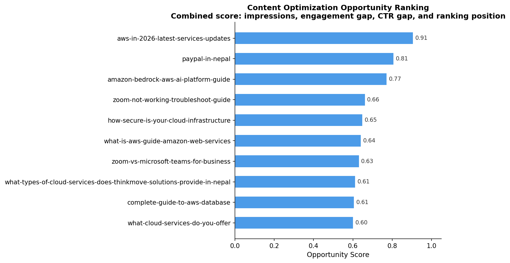

# Google Search Analytics Intelligence System

Cross-platform SEO and engagement analysis integrating Google Search Console and Google Analytics 4 to evaluate content performance across visibility, traffic, engagement quality, and optimization opportunities.

> Data files are excluded from this repository (see `data/`). The notebook documents all column names, data formats, and transformation steps needed to reproduce the analysis with your own exports.

---

## Overview

This project builds a page-level SEO analytics pipeline that merges two datasets most teams analyze in isolation: search visibility data from Google Search Console and behavioral engagement data from Google Analytics 4.

The core question driving the analysis:

> Does a page that ranks well actually satisfy the users who find it?

The analysis covers **74 matched pages** from a Nepal-based SaaS and IT consulting company across a five-month period (Jan–May 2026), surfacing content gaps, intent mismatches, and optimization opportunities through integrated SEO and engagement metrics.

---

# Analysis Pipeline

## Phase 1 — Page classification

Page-level GSC and GA4 exports are cleaned, normalized, and merged into a unified dataset.

### Data integration

The project handles structural inconsistencies between platforms:

- GSC exports full URLs
- GA4 exports relative paths

A normalization pipeline standardizes URLs through:

- lowercasing
- domain stripping
- whitespace cleanup
- trailing slash removal

before merging on the `Page` key.

### Data sources

| Platform | Metrics |
|---|---|
| Google Search Console | clicks · impressions · CTR · average position |
| Google Analytics 4 | sessions · active users · new users · engagement time · conversion signals |

---

## Engineered metrics

| Metric | Formula | Purpose |
|---|---|---|
| `visibility_score` | `impressions × CTR` | Effective visibility weighted by click likelihood |
| `click_to_session_ratio` | `ga_sessions / gsc_clicks` | Detects external or non-organic traffic dependence |
| `engagement_efficiency` | `engagement_time / sessions` | Measures content quality efficiency |
| `engagement_per_session` | engagement time per page | Absolute engagement depth |

---

## Rule-based content classification

Pages are segmented into operational SEO categories.

| Category | Logic | Interpretation |
|---|---|---|
| High visibility / low engagement | impressions > 20,000 AND sessions < 100 | Strong rankings but weak satisfaction |
| High quality content | engagement time > 30s | Users invest meaningful time |
| High traffic driver | GSC clicks > 100 | Proven organic demand |
| Normal | Remaining pages | Baseline performers |

---

# Key findings

## The visibility–engagement gap

The highest-impression page:

`/blogs/aws-in-2026-latest-services-updates`

generated:

- 80,547 impressions
- only 17.7s engagement time
- engagement efficiency of 0.03

Meanwhile:

`/zoom`

generated:

- only 4,076 impressions
- 74s engagement time
- engagement efficiency of 1.14

Despite dramatically lower visibility, the Zoom page produced substantially deeper engagement.

This pattern appears repeatedly across the dataset:

> High visibility does not necessarily indicate strong content satisfaction.

---

## AWS informational content cluster

### `/blogs/aws-in-2026-latest-services-updates`

- 80,547 impressions
- 29 GSC clicks
- 592 GA4 sessions
- 17.7s average engagement
- CTR: 0.04%

The combination of:

- strong rankings
- extremely low CTR
- weak engagement

suggests search-intent mismatch and weak SERP positioning despite visibility.

The page also produced a `click_to_session_ratio` above 20×, indicating substantial non-organic traffic influence.

---

## Zoom content cluster

### `/zoom`

- 74s average engagement
- 107 GSC clicks
- 4,076 impressions
- engagement efficiency: 1.14

### `/blogs/zoom-not-working-troubleshoot-guide`

- 36.8s average engagement
- 140 sessions

Both pages substantially outperform AWS informational content on engagement metrics, suggesting significantly stronger intent alignment.

---

## PayPal in Nepal

### `/blogs/paypal-in-nepal`

- 349 GSC clicks
- average position: 4.46
- 257 sessions
- 215 new users
- 29.6s engagement time

This page demonstrates:

- strong informational demand
- strong local search relevance
- high acquisition capability

The relatively moderate engagement time is consistent with high-intent informational queries where users find answers quickly.

---

# Phase 2 — Query intent analysis

The project expands beyond page-level analysis into query-level behavioral interpretation.

A total of:

- 2,611 queries
- across 6 major pages

were classified into five intent categories.

---

## Intent categories

| Intent type | Description |
|---|---|
| Informational | Learning or explanation-driven searches |
| Commercial | Comparison, pricing, or evaluation intent |
| Troubleshooting | Error resolution or issue-fixing intent |
| Transactional | Action-oriented conversion intent |
| Local | Geographic or regional intent |

---

## Dominant intent by page

| Page | Dominant intent | Engagement efficiency |
|---|---|---|
| /zoom | Commercial | 1.14 |
| /blogs/zoom-not-working-troubleshoot-guide | Informational | 0.26 |
| /blogs/paypal-in-nepal | Informational + Local | 0.12 |
| /blogs/simple-comparison-of-zoom-vs-discord | Commercial | 0.04 |
| /blogs/aws-in-2026-latest-services-updates | Informational | 0.03 |
| /blogs/amazon-bedrock-aws-ai-platform-guide | Informational | 0.03 |

---

## Key insight: same intent, different outcomes

Both:

- `/zoom`
- `/blogs/simple-comparison-of-zoom-vs-discord`

are dominated by commercial-intent queries.

However, their engagement efficiency differs by nearly 27×.

This demonstrates that:

> intent classification alone does not determine success. Execution quality and content specificity matter substantially more.

---

## Local intent behavior

`/blogs/paypal-in-nepal`

showed a strong concentration of geographically qualified queries, such as:

- "paypal in nepal"
- "is paypal available in nepal"

This explains:

- strong click performance
- high new-user acquisition
- sustained organic demand

despite moderate engagement depth.

---

## Content performance quadrant

The project visualizes content positioning using:

- X-axis → search visibility (impressions)
- Y-axis → engagement efficiency
- bubble size → session volume
- color → dominant query intent

This reveals distinct performance clusters and optimization priorities.


---

# Phase 3 — Opportunity scoring

The final stage introduces a weighted SEO opportunity model designed to prioritize pages with the highest optimization potential.

The scoring model combines four dimensions:

| Factor | Purpose |
|---|---|
| Impressions | Existing search visibility |
| Engagement gap | Poor satisfaction relative to peers |
| CTR gap | Underperforming SERP attractiveness |
| Search position | Ranking improvement potential |

---

## Opportunity score formula

Each metric is normalized to a 0–1 range before weighting.

| Component | Weight |
|---|---|
| Visibility potential | 35% |
| Engagement gap | 35% |
| CTR gap | 20% |
| Position improvement potential | 10% |

Higher scores indicate pages with:

- strong visibility
- weak engagement
- low CTR
- recoverable ranking opportunities

These represent the highest-leverage optimization candidates.

---

## Opportunity ranking visualization

The final visualization ranks the top content optimization opportunities across the dataset.



---

# Project structure

```text
SEO-Analysis/
│
├── data/                               # excluded via .gitignore
│   ├── gsc_pages.csv
│   ├── gsc_queries.csv
│   ├── ga4_landing_page.csv
│   ├── aws_bedrock_queries.csv
│   ├── aws_updates_queries.csv
│   ├── paypal_in_nepal_queries.csv
│   ├── zoom_queries.csv
│   ├── zoom_troubleshoot_queries.csv
│   └── zoom_discord_queries.csv
│
├── google-analysis/
│   ├── notebook/
│   │   └── seo-analysis.ipynb
│   │
│   └── output/
│       └── chart/
│           ├── quadrant_plot.png
│           └── opportunity_score.png
│
├── .gitignore
├── LICENSE
├── README.md
└── requirements.txt
````

---

# Setup

```bash
git clone https://github.com/sonaml-007/SEO-Analysis.git
cd SEO-Analysis

pip install -r requirements.txt

python -m notebook
```

---

# Reproducibility

To reproduce the analysis:

1. Export:

   * GSC Pages report
   * GSC Queries report
   * GA4 Landing Pages report

2. Place files inside the `data/` directory.

3. Run the notebook pipeline from:
   `google-analysis/notebook/seo-analysis.ipynb`

All expected column names and formats are documented inside the notebook.

---

# Tech stack

| Tool             | Purpose                                |
| ---------------- | -------------------------------------- |
| Python           | Data processing                        |
| Pandas           | Cleaning, merging, feature engineering |
| Matplotlib       | Visualization                          |
| Jupyter Notebook | Analysis workflow                      |
| VS Code          | Development environment                |
| Git & GitHub     | Version control                        |

---

# Author

**Sonam Lama**

```
```
